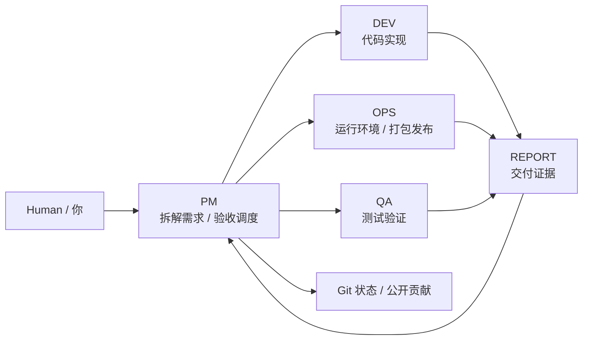
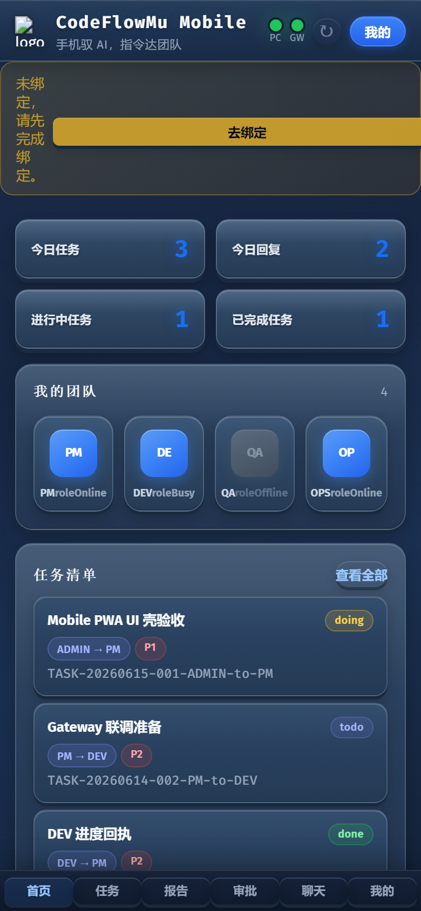
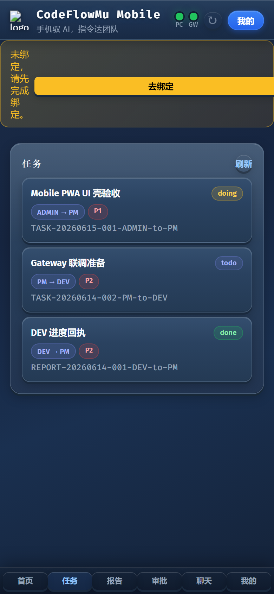
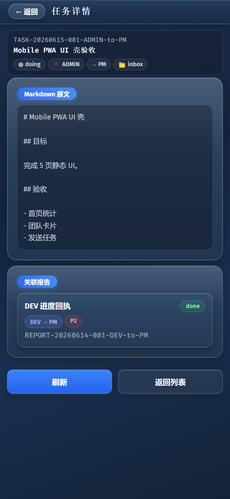
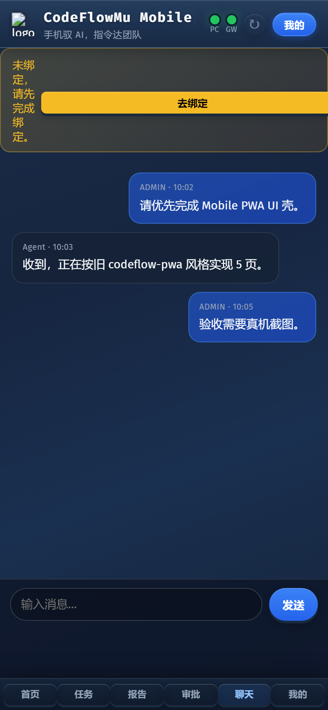
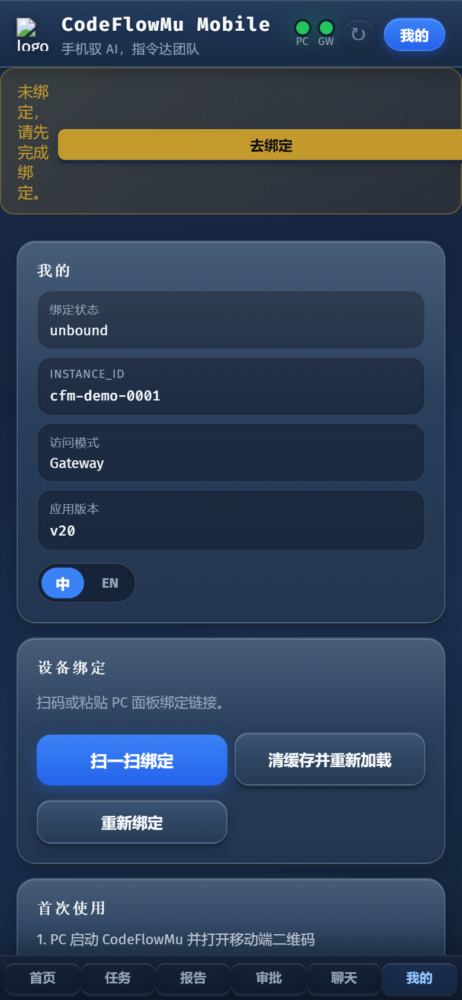

# CodeFlowMu Open Dev Team Edition

## PM planning and product design

The development-team edition uses Level 0-3 PM planning. Queries and inspections need no brief; small fixes use lightweight analysis; ordinary features use a standard plan; complex products use a full Product Brief with verifiable skill evidence. Dispatch order is planning, Runtime validation, downstream task creation, then explicit PM wake. See `docs/skills/pm-planning-governance.md`.

This is a CodeFlowMu development-team workflow above FCoP, not an FCoP core-protocol requirement.

<p align="center">
  
</p>

<p align="center">
  <strong>码流 CodeFlowMu：把 AI Agent 组织成一个本地开发团队。</strong><br>
  <strong>CodeFlowMu turns local AI agents into a coordinated development team.</strong>
</p>

<p align="center">
  <a href="#中文">中文</a> ·
  <a href="README.zh.md">完整中文介绍</a> ·
  <a href="#english">English</a> ·
  <a href="INSTALL.md">Install</a> ·
  <a href="docs/open/getting-started.md">Getting Started</a>
</p>

---

## 中文

CodeFlowMu Open Dev Team Edition 是 FCoP 协议治理下、通过 Cursor SDK 接口驱动的多 Agent 开发团队应用，面向本地安装、体验、二次开发和贡献。

当前开源版本：`V1.1.25-open`

它不是母体私有仓库的完整镜像，也不是用来开发 CodeFlowMu 自身的目录。开发执行团队固定为 PM / DEV / OPS / QA；EVAL 作为独立观察者评估质量、风险与交付信号，不属于开发执行团队。

- 固定开发团队：`PM / DEV / OPS / QA`
- 独立观察者：`EVAL`
- 固定接入：`Cursor SDK only`
- 默认本地运行：`http://127.0.0.1:18765/`
- 单实例安装：每台电脑当前只支持一个标准安装，Windows 默认 `D:\CodeFlowMu-open`
- 默认连接官方演示 / 受限 Gateway，不连接私有 Gateway
- 受保护工具根：`CodeFlowMu-open` 自身不能作为任务开发目标
- 保留 Git 状态、任务、报告、审批、聊天、项目配置、数据导出和任务模板
- 不包含母体真实运行记录、私有日志、私有 Gateway 凭据、内部评估/观察流和公司私有发布能力

如果你见过旧的 `joinwell52-AI/codehouse` / CodeFlow 仓库，可以把它理解成上一代产品叙事与实验现场。CodeFlowMu Open 是新的公开入口：保留“指令成流、文件协作、多 Agent 团队”的核心思想，但以干净的公开发行包、固定开发团队、可重复初始化和可贡献的源码结构重新组织。

### 一句话

把需求、任务、代码、报告和验收放进同一个本地协作面板里，让 PM、DEV、OPS、QA 四个 Agent 以文件协议协同工作。

### 本地团队

<p align="center">
  
</p>



### 快速开始

Windows 推荐：

```bat
START-CODEFLOWMU-OPEN.bat
```

手动方式：

```bash
git clone https://github.com/joinwell52-AI/CodeFlowMu-open.git
cd CodeFlowMu-open
npm install
npm start
```

打开：

```text
http://127.0.0.1:18765/
```

首次启动会进入干净初始化状态：清理公开版运行缓存，保留源码、Git 历史、`node_modules` 和 `.venv`。

启动后请先在「设置 → 项目」添加你的产品/代码目录，并切换为当前项目。任务、报告、FCoP 初始化、附件和 Agent 会话都会写入这个外部项目根；公开版不会更新自己的 `CodeFlowMu-open` 源码目录。

### 安装与更新

公开仓库面向下载、安装、介绍和贡献。一个全新发版会由母版构建为完整开源版本包，包含源码、面板、Shell、公开文档、公开初始化源、启动器、`VERSION.json`、`RELEASES.md` 和 `UPDATE.md`。

更新策略采用全量更新：应用文件整体替换，保留 `.git/`、`node_modules/`、`.venv/`、本机 `.env`、`.codeflowmu/mobile-gateway.json`、`projects/`、旧版 `workspace/` 和外部项目根。

用户侧更新：

```bash
cd CodeFlowMu-open
git pull
npm install
START-CODEFLOWMU-OPEN.bat
```

### 开源版包含什么

<p align="center">
  
</p>

| 模块 | 开源版状态 |
|---|---|
| PC Panel | 可用 |
| Mobile PWA | 本地局域网体验 |
| PM / DEV / OPS / QA | 固定开发团队 |
| EVAL | PM 最终 REPORT 后自动生成旁路观察；按钮用于重试/刷新 |
| 当前项目 | 默认 `projects/newproject` 可直接使用；旧 `workspace/<项目>` 继续兼容 |
| CodeFlowMu-open 自身 | 工具根，受保护，不作为任务目标 |
| Git 状态 | 可用 |
| 技能库 | 公开 manifest 与 playbook |
| Gateway | 官方演示只读连接；可比较线上 PWA 版本，不能从 Open 发布或覆盖线上资源 |
| Provider | Cursor SDK only |

### 界面一览

<p align="center">
  
  
</p>
<p align="center">
  
  
</p>
<p align="center">
  
</p>

### 初始化源

公开包带有可公开初始化源：

```text
adoptedSource/fcop/
adoptedSource/pending/
docs/skills/
docs/open/
```

不会带入：

```text
adoptedSource/gateway/
private/
.env
真实任务、报告、日志、聊天历史
```

### 仓库关系

```text
私有母体仓库：
joinwell52-AI/codeflowmu

公开开源仓库：
joinwell52-AI/CodeFlowMu-open
```

母体负责版本选择、构建、同步、清理运行态和发布；公开仓库负责下载、安装、介绍、体验和贡献入口。

GitHub 仓库 About / topics 建议见 [docs/open/github-repo-about.md](docs/open/github-repo-about.md)。

---

## English

CodeFlowMu Open Dev Team Edition is an FCoP-governed multi-agent development team application driven through Cursor SDK interfaces. It is the public open-source edition for local installation, hands-on evaluation, development, and contribution.

Current open edition version: `V1.1.25-open`

It is not a full mirror of the private mother repository, and it is not meant to develop CodeFlowMu itself. The execution team is fixed to PM / DEV / OPS / QA. EVAL is an independent observer for quality, risk, and delivery signals, not a member of the development execution chain.

- Fixed development team: `PM / DEV / OPS / QA`
- Independent observer: `EVAL`
- Fixed provider: `Cursor SDK only`
- Local default: `http://127.0.0.1:18765/`
- Single install: one standard CodeFlowMu Open install per computer; Windows default is `D:\CodeFlowMu-open`
- Private Gateway auto-connect is disabled by default
- Protected tool root: `CodeFlowMu-open` itself is not a development target
- Git status, tasks, reports, approvals, chat, project settings, data export, and task templates are available
- Private runtime history, private logs, Gateway credentials, internal observation/evaluation flows, and company release tooling are excluded

If you have seen the old `joinwell52-AI/codehouse` / CodeFlow repository, treat it as the previous product narrative and experiment ground. CodeFlowMu Open is the new public entry point: the same core idea of command flow, file-based collaboration, and multi-agent teams, reorganized as a clean public distribution with a fixed dev team, repeatable first-run initialization, and a contribution-ready source layout.

### What It Does

CodeFlowMu gives local AI agents a shared collaboration surface: requirements become tasks, tasks produce reports, reports carry evidence, PM/DEV/OPS/QA move work through a visible workflow, and EVAL observes independently.

### Quick Start

Recommended on Windows:

```bat
START-CODEFLOWMU-OPEN.bat
```

Manual:

```bash
git clone https://github.com/joinwell52-AI/CodeFlowMu-open.git
cd CodeFlowMu-open
npm install
npm start
```

Open:

```text
http://127.0.0.1:18765/
```

The first launch initializes a clean open-edition runtime state. It removes generated public runtime caches while keeping source files, Git history, `node_modules`, and `.venv`.

First launch creates and initializes `projects/newproject` as the active project. `projects/` contains multiple independent CodeFlowMu team projects; each project owns its `fcop/` ledger and may use an internal `workspace/<product>` only in multi-product mode. Registered legacy `workspace/<project>` roots continue to run in place and are never moved automatically. Runtime data lives at `<active-project>/.codeflowmu/runtime`.

`CodeFlowMu-open` is the protected tool-install root. Agents retain full capability inside the active business project, while the install-integrity shell restores protected application code to its startup baseline. If no Cursor API Key is configured, formal TASK files remain in inbox instead of being consumed by the in-memory test adapter. A PM final REPORT automatically produces the EVAL closeout observation; the EVAL button is retained for retry or refresh.

### Install And Update

The public repository is for download, installation, introduction, and contribution. Each fresh release is built by the mother repository as a complete open-edition package with source, panel assets, Shell, public docs, public initialization sources, launcher, `VERSION.json`, `RELEASES.md`, and `UPDATE.md`.

Updates use a full replacement strategy: application files are replaced as a whole, while `.git/`, `node_modules/`, `.venv/`, local `.env`, `.codeflowmu/mobile-gateway.json`, `projects/`, legacy `workspace/`, and external project roots are preserved.

User update flow:

```bash
cd CodeFlowMu-open
git pull
npm install
START-CODEFLOWMU-OPEN.bat
```

### Edition Boundary

| Area | Open Edition |
|---|---|
| PC Panel | Available |
| Mobile PWA | Local LAN experience |
| PM / DEV / OPS / QA | Fixed development team |
| EVAL | Closeout observation is automatic after PM final REPORT; button retries or refreshes |
| Active project | Default `projects/newproject` works immediately; registered legacy `workspace/<project>` roots remain compatible |
| CodeFlowMu-open itself | Protected tool root, not a task target |
| Git Status | Available |
| Skills | Public manifest and playbooks |
| Gateway | Official demo is read-only; version comparison is available, remote publish is disabled |
| Provider | Cursor SDK only |

### Screenshots

<p align="center">
  
  
</p>
<p align="center">
  
  
</p>
<p align="center">
  
</p>

### Public Initialization Sources

Included:

```text
adoptedSource/fcop/
adoptedSource/pending/
docs/skills/
docs/open/
```

Excluded:

```text
adoptedSource/gateway/
private/
.env
real tasks, reports, logs, and chat history
```

### Contributing

Good first contribution areas:

- Windows/macOS/Linux install flow
- Four-role development workflow plus an independent EVAL observer
- Git status and project configuration UX
- Public docs, templates, and examples
- Panel usability and local runtime stability

See also:

- [Install](INSTALL.md)
- [Getting Started](docs/open/getting-started.md)
- [Edition Boundary](docs/open/edition-boundary.md)
- [Gateway Policy](docs/open/gateway-demo.md)
- [GitHub Repository About](docs/open/github-repo-about.md)
- [Open Edition Articles](docs/articles/README.md)
- [Open Edition Scope](docs/articles/open-edition-scope.md)
- [Open Edition Directory Manual](docs/articles/open-edition-directory-manual.md)
- [Release Content Boundary](docs/articles/release-content-boundary.md)
- [Contributing](docs/open/contributing.md)
