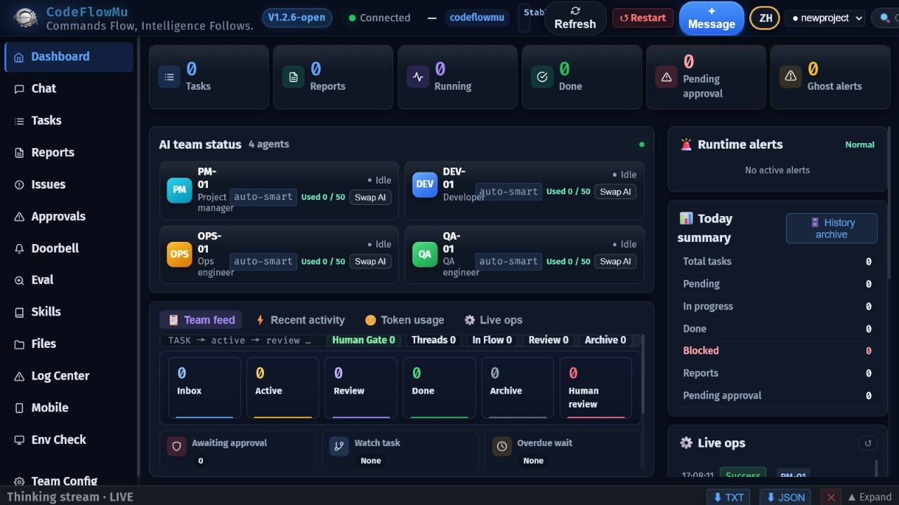
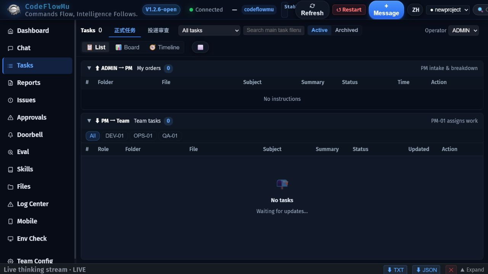
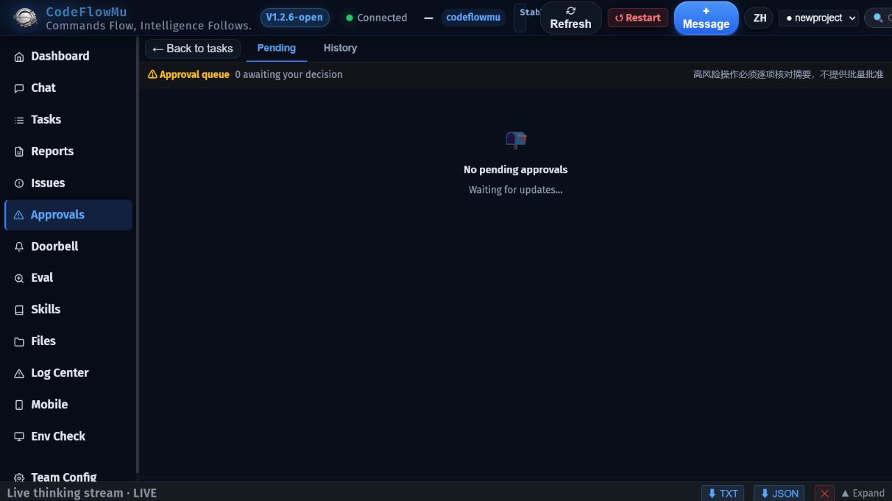
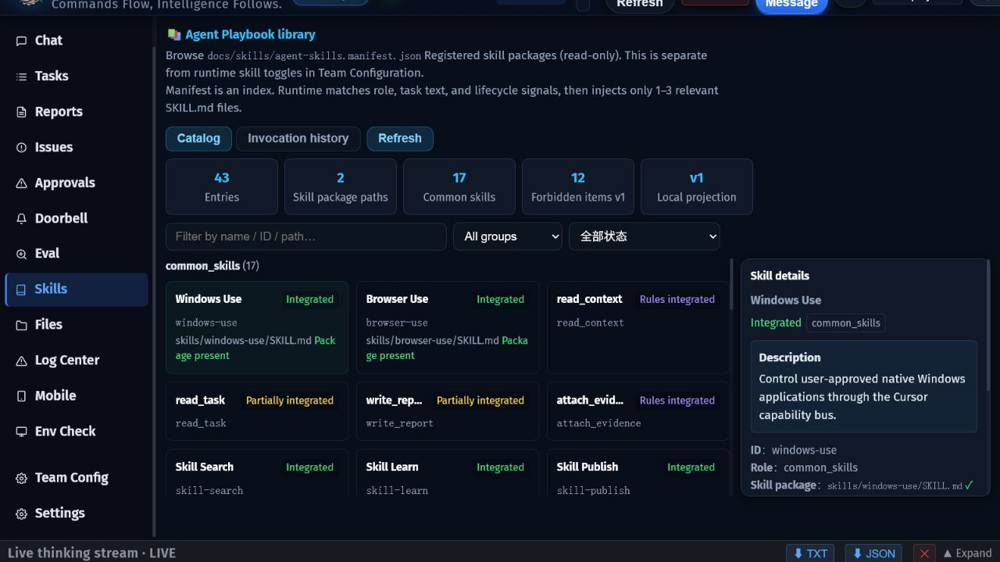
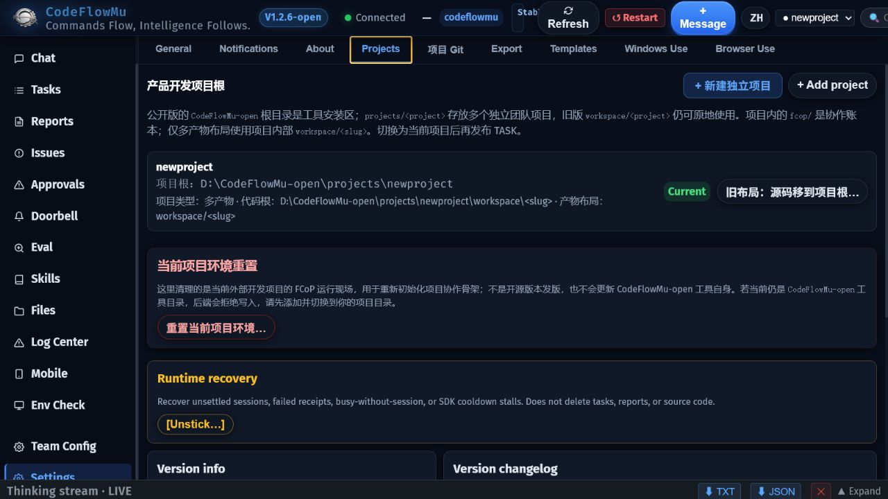
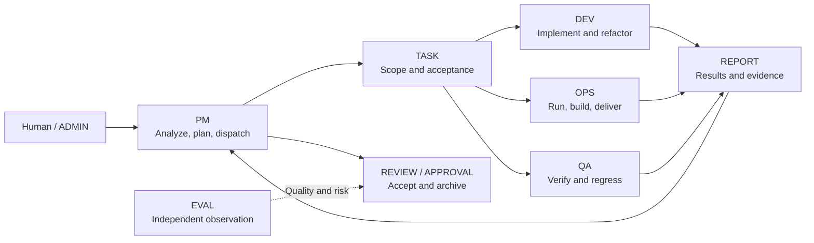

# CodeFlowMu Open Dev Team Edition

<p align="center">
  
</p>

<p align="center">
  <strong>Turn local AI agents into a visible, auditable, and coordinated development team.</strong>
</p>

<p align="center">
  <code>V1.2.23-open</code> · <code>Windows 10/11</code> · <code>Node.js 22+</code> · <code>Python 3.10+</code> · <code>Cursor SDK</code>
</p>

<p align="center">
  <a href="README.zh.md">Simplified Chinese README</a> ·
  <a href="#quick-install">Quick Install</a> ·
  <a href="#real-product-screens">Product Screens</a> ·
  <a href="INSTALL.md">Installation Guide</a> ·
  <a href="docs/open/help.md">Illustrated PC & PWA Manual</a>
</p>

---

CodeFlowMu Open is a local-first multi-agent development team application. You submit a requirement; PM analyzes and dispatches it, DEV implements it, OPS handles runtime and delivery, and QA verifies it. Tasks, reports, evidence, approvals, and project state are visible in the PC Panel and available from the Mobile PWA.

It is not another chat window. It gives multiple agents one traceable delivery lifecycle:

```text
Requirement → PM Plan → TASK → DEV / OPS / QA → REPORT → REVIEW / APPROVAL → Done
```

## Core Capabilities

| Capability | What it provides |
|---|---|
| Multi-agent development team | A fixed execution team of `PM / DEV / OPS / QA`, with `EVAL` observing quality and risk independently |
| File-based collaboration | TASK, REPORT, REVIEW, ISSUE, and evidence artifacts are persisted for audit and handoff |
| PC control panel | Dashboard, tasks, reports, approvals, chat, skills, files, logs, projects, and team settings |
| Mobile PWA | View team state, tasks, reports, approvals, and activity; publish tasks and message roles from a phone |
| Project isolation | The protected installation root is separate from business projects; every installation owns an isolated Runtime identity |
| Human approval gates | Destructive actions, external writes, and authority-boundary changes require approval before execution |
| Windows and Browser Use | Agents can operate only the applications and browser targets explicitly approved by the user |
| Public Agent Playbooks | Skills are loaded from the public manifest, with project-local packages taking precedence over installation packages |

## Real Product Screens

Every image below is captured from the real product, not a concept mockup. The current application version is `V1.2.23-open`; the English PC screenshots were captured from the running `V1.2.6-open` application. The phone screenshots are real PWA captures from V1.0.58, with the release-notes view from V1.0.59.

### PC Panel: the complete team at a glance

<p align="center">
  
</p>

The dashboard brings the active project, PM/DEV/OPS/QA state, task and report totals, runtime alerts, approval queues, and live activity into one view. Project and instance information at the top helps confirm that agents are working in the intended business directory.

### From task dispatch to controlled approval

<p align="center">
  
</p>
<p align="center"><sub>Task center: formal tasks, submission review, lists, boards, and timelines</sub></p>

<p align="center">
  
</p>
<p align="center"><sub>Operation approvals: human authorization before high-risk actions</sub></p>

The task center supports formal tasks, pre-publication review, list, board, and timeline views. The approval center is reserved for actions that genuinely require human authorization. Approval allows an execution attempt; REPORT evidence still determines whether the work succeeded.

### Visible skills and project boundaries

<p align="center">
  
</p>
<p align="center"><sub>Agent Playbook library: packages, role mappings, and load state</sub></p>

<p align="center">
  
</p>
<p align="center"><sub>Projects and versions: business roots, active-project switching, and release history</sub></p>

The skill library exposes Playbook package and mapping state. Project management creates, registers, and switches business projects while rebinding Runtime, MCP, watchers, and agent working directories together.

### Mobile PWA: stay connected away from the PC

<p align="center">
  <a href="docs/images/pwa/V1.0.58/pwa-dashboard-V1.0.58.png"></a>
  &nbsp;
  <a href="docs/images/pwa/V1.0.58/pwa-tasks-timeline-V1.0.58.png"></a>
  &nbsp;
  <a href="docs/images/pwa/V1.0.58/pwa-reports-V1.0.58.png"></a>
  &nbsp;
  <a href="docs/images/pwa/V1.0.58/pwa-chat-V1.0.58.png"></a>
</p>
<p align="center"><sub>Dashboard · Task timeline · Reports · Team chat — click a thumbnail to open the full image</sub></p>

The PWA provides dashboards, tasks, reports, approvals, activity, chat, and device status. Timelines make parent-child task relationships visible, reports expose delivery evidence, and chat reaches the responsible role directly.

> Continue with the [illustrated PC & PWA manual](docs/open/help.md). The [Chinese manual](docs/open/help.zh.md) is available separately.

## Team Workflow


```mermaid
flowchart LR
  Human["Human / ADMIN"] --> PM["PM<br/>Analyze, plan, dispatch"]
  PM --> TASK["TASK<br/>Scope and acceptance"]
  TASK --> DEV["DEV<br/>Implement and refactor"]
  TASK --> OPS["OPS<br/>Run, build, deliver"]
  TASK --> QA["QA<br/>Verify and regress"]
  DEV --> REPORT["REPORT<br/>Results and evidence"]
  OPS --> REPORT
  QA --> REPORT
  REPORT --> PM
  PM --> REVIEW["REVIEW / APPROVAL<br/>Accept and archive"]
  EVAL["EVAL<br/>Independent observation"] -.->|Quality and risk| REVIEW
```

Complex product work passes through PM Level 0–3 planning before downstream tasks are created. See the [PM planning and product-design policy](docs/skills/pm-planning-governance.md).

## Quick Install

### Requirements

- Windows 10/11 (recommended; includes the launcher)
- Node.js 22+
- Python 3.10+
- Git
- Cursor SDK access and an API Key

### Recommended Windows installation

Run in Command Prompt:

```bat
cd /d D:\
git clone https://github.com/joinwell52-AI/CodeFlowMu-open.git
cd CodeFlowMu-open
START-CODEFLOWMU-OPEN.bat
```

The launcher checks Node.js and npm, creates `.venv`, installs Python `fcop` and Node dependencies, and starts the local panel at:

```text
http://127.0.0.1:18765/
```

The official launcher is `START-CODEFLOWMU-OPEN.bat`. See [INSTALL.md](INSTALL.md) for the complete installation guide.

### Manual startup

```bash
git clone https://github.com/joinwell52-AI/CodeFlowMu-open.git
cd CodeFlowMu-open
npm install
npm start
```

## First Run

1. Open **Settings → General**, enter the Cursor API Key, and verify it.
2. Open **Settings → Projects** and use `projects/newproject`, create an independent project, or register an existing source directory.
3. Set the intended directory as the active project and wait for Runtime adaptation to complete.
4. Run the environment preflight; initialize or repair FCoP only when the panel reports that it is required.
5. Publish the first TASK and follow execution through Tasks, Reports, and Live Activity.

> `CodeFlowMu-open` is the protected tool installation root, not a business project for agents to edit. Source changes, TASK files, REPORT files, attachments, and the FCoP ledger belong in the active project root.

## How to Complete the First Task Cycle

| Step | PC Panel location | Action | Success signal |
|---|---|---|---|
| 1. Confirm the service | Header / Dashboard | Open `127.0.0.1:18765` | The header shows a green connected state |
| 2. Configure the model | Settings → General | Enter and verify the Cursor API Key | Verification is green and models are loaded |
| 3. Select a project | Settings → Projects | Use the default project, create one, or register existing source; set it active | Header project and project root match |
| 4. Check the environment | Environment Preflight | Initialize or repair FCoP only when prompted | No blocker remains; Runtime is bound to the project |
| 5. Publish work | Tasks → Submission Review | Enter a task or upload a Markdown task specification; review and publish | A formal TASK appears in the task list |
| 6. Follow execution | Dashboard / Tasks / Live Activity | Watch PM dispatch DEV, OPS, and QA work | Child tasks move through the lifecycle and REPORT files appear |
| 7. Accept the result | Reports / Approvals | Read results and evidence; approve only requested high-risk actions | PM accepts the result or starts a rework cycle |
| 8. Add mobile access | Mobile / PWA Settings | Obtain the binding entry from the PC and bind the phone | PC and Gateway states are healthy in the PWA |

> **Illustrated manual:** open the [CodeFlowMu Open PC & PWA Help Manual](docs/open/help.md) for step-by-step coverage of projects, tasks, approvals, skills, Git, data tools, and mobile operation.

## Installation Root and Business Projects

```text
D:\CodeFlowMu-open\                 # Protected tool installation root
├─ projects\newproject\             # Default business project
├─ projects\<your-project>\         # Independent projects created in the panel
└─ ...                               # Panel / Shell / Runtime / docs

D:\YourExistingProject\             # Existing external projects can also be registered
└─ fcop\                             # Project-owned task and collaboration ledger
```

Every installation creates its own `.codeflowmu/instance.json`. Agent and Session Runtime state lives under `%USERPROFILE%\.codeflowmu\instances\<instance_id>\`, so copied installations and same-named projects do not share Runtime identities.

## Update

Stop the current service, then run:

```bat
cd /d D:\CodeFlowMu-open
git pull --ff-only
npm install
START-CODEFLOWMU-OPEN.bat
```

An update replaces application source, Panel assets, Shell/Runtime source, documentation, and public templates. It preserves `.git/`, `.venv/`, `node_modules/`, local `.env` files, `projects/`, legacy `workspace/`, and external business projects.

## Open Edition Boundary

### Included

- PC Panel and local Mobile PWA
- PM / DEV / OPS / QA development team
- Independent EVAL quality and risk observation
- FCoP collaboration protocol and public Agent Playbooks
- Cursor SDK integration
- Explicitly authorized Windows Use and Browser Use
- Git status, task templates, data export, and project management

### Excluded

- Private Gateway credentials and company-only release infrastructure
- Real mother-edition tasks, reports, logs, chats, or customer data
- `.env`, tokens, API keys, and other secrets
- Private multi-provider switching for Google Gen AI, Claude Code, or OpenRouter
- Internal governance experiments and private runtime history

The Open and mother editions use different ports, instance identities, and runtime state. The default Open address is `127.0.0.1:18765`.

## Documentation

- [Installation](INSTALL.md)
- [Getting Started](docs/open/getting-started.md)
- [Illustrated PC & PWA Manual](docs/open/help.md)
- [Chinese PC & PWA Manual](docs/open/help.zh.md)
- [Edition Boundary](docs/open/edition-boundary.md)
- [Gateway Policy](docs/open/gateway-demo.md)
- [Directory Guide](docs/articles/open-edition-directory-manual.md)
- [Contributing](docs/open/contributing.md)

## Contributing

Contributions are welcome in installation experience, cross-platform support, Panel/PWA usability, task workflows, documentation, tests, and local Runtime stability. Before submitting, make sure the change contains no real tasks, reports, logs, customer data, secrets, or private Gateway configuration.

---

<p align="center"><strong>Commands Flow, Intelligence Follows.</strong></p>
