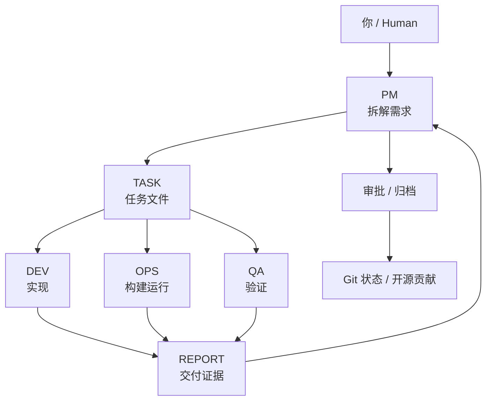

# 码流 CodeFlowMu Open Dev Team Edition

## PM 分析与产品设计

开发团队版采用 Level 0–3 PM 规划分级：查询/巡检不要求方案，小修复使用轻量分析，普通功能使用标准方案，复杂产品使用完整 Product Brief 与可核对的技能执行证据。派单顺序固定为“规划 → Runtime 验证 → 创建下游任务 → PM 显式唤醒”。完整规范见 `docs/skills/pm-planning-governance.md`。

这是 CodeFlowMu 开发团队版叠加在 FCoP 之上的工作规范，不是 FCoP 核心协议要求。

<p align="center">
  
</p>

<p align="center">
  <strong>指令成流，智能随行。</strong><br>
  把 AI Agent 组织成一个可见、可审计、可协作的本地开发团队。
</p>

<p align="center">
  <a href="README.md">中英双语首页</a> ·
  <a href="INSTALL.md">安装说明</a> ·
  <a href="docs/open/getting-started.md">快速开始</a> ·
  <a href="docs/open/edition-boundary.md">版本边界</a>
</p>

---

## 这是什么

CodeFlowMu Open Dev Team Edition 是 FCoP 协议治理下、通过 Cursor SDK 接口驱动的多 Agent 开发团队应用，也是 CodeFlowMu 的公开开源版本。

当前开源版本：`V1.1.25-open`

它面向四件事：

- 下载和安装
- 本地体验
- 学习 FCoP 文件协作协议如何驱动多 Agent
- 参与开源贡献

它不是母体私有仓库的完整镜像，也不是用来开发 CodeFlowMu 自身的目录。开发执行团队固定为 PM / DEV / OPS / QA；EVAL 是独立观察者，不属于开发执行团队。

```text
开发团队：PM / DEV / OPS / QA
独立观察：EVAL
接入：Cursor SDK only
运行：本地优先
端口：http://127.0.0.1:18765/
安装：每台电脑只支持一个标准安装，Windows 默认 D:\CodeFlowMu-open
工具根：CodeFlowMu-open 自身受保护，不能作为任务开发目标
```

母体私有仓库承载完整多版本、多通道、内部 Gateway、内部观察流和公司发布能力；公开仓库只承载适合开源下载、安装、体验和贡献的部分。

如果你见过旧的 `joinwell52-AI/codehouse` / CodeFlow 仓库，可以把它理解成上一代产品叙事与实验现场。CodeFlowMu Open 是新的公开入口：保留“指令成流、文件协作、多 Agent 团队”的核心思想，但以干净的公开发行包、固定开发团队、可重复初始化和可贡献的源码结构重新组织。

## 为什么需要它

很多 Agent 工具只解决“让一个 AI 回答问题”。

CodeFlowMu 想解决的是另一件事：让多个 AI 角色围绕同一份任务、报告、证据和验收记录协作。

在公开版里，你会看到一个本地开发团队：

| 角色 | 负责什么 |
|---|---|
| PM | 拆解需求、派发任务、验收调度 |
| DEV | 写代码、重构、实现功能 |
| OPS | 运行环境、构建、打包、发布调度 |
| QA | 测试、回归、质量验证 |
| EVAL | 观察当前开发项目的质量、风险和交付信号 |

协作不是只留在聊天窗口里，而是落到文件和账本里：

```text
TASK  ->  执行  ->  REPORT  ->  REVIEW / APPROVAL
```

这让工作可以回看、可以交接、可以审计，也更适合真实项目持续演进。

## 工作流

<p align="center">
  
</p>



## 快速开始

Windows 推荐：

```bat
START-CODEFLOWMU-OPEN.bat
```

手动方式：

```bash
git clone https://github.com/joinwell52-AI/CodeFlowMu-open.git
cd CodeFlowMu-open
npm install
npm start
```

打开本地面板：

```text
http://127.0.0.1:18765/
```

首次启动会生成并初始化 `projects/newproject`，它立即就是当前项目，无需先手工建立目录。`projects/` 是多个 CodeFlowMu 团队项目的集合目录；项目内的 `fcop/` 保存协作与任务账本，仅多产物布局使用项目内部 `workspace/<产品名>`。旧版 `workspace/<项目名>` 会按注册表中的绝对路径继续原地运行，不会自动移动或覆盖。你也可以进入「设置 → 项目」新建独立项目或登记已有源码；切换完成后再发布 TASK。Runtime 位于 `<当前项目>/.codeflowmu/runtime`。

`CodeFlowMu-open` 是工具安装根。Agent 在当前业务项目内保持完整开发能力；如果它尝试修改安装代码，自保护壳会恢复启动基线。未配置 Cursor API Key 时，正式 TASK 会留在 inbox 并提示配置，不会被测试适配器假装执行。

首次启动会做公开版初始化：

- 创建或使用本地 `.venv`
- 安装 Python 依赖 `fcop`
- 安装 Node 依赖
- 清理公开版运行缓存
- 保留源码、Git 历史、`node_modules` 和 `.venv`
- 固定 `CODEFLOW_PROVIDER=cursor`

## 开源版本如何更新

开源版采用全量更新，不做差量补丁。母版每次构建完整开源版本包，再同步到 `joinwell52-AI/CodeFlowMu-open`。

全量更新会替换：

- 应用源码
- Panel 页面
- Shell / Runtime 源码
- docs 文档
- 公开初始化模板
- 启动器与版本文件

全量更新必须保留：

- `.git/`
- `node_modules/`
- `.venv/` 和 `venv/`
- `.env`、`.env.*`
- `.codeflowmu/mobile-gateway.json`
- `projects/`（新项目集合）
- `workspace/`（旧版项目集合，仅兼容保留）
- `CodeFlowMu-open` 外部的项目根

用户侧更新方式：

```bash
cd CodeFlowMu-open
git pull
npm install
START-CODEFLOWMU-OPEN.bat
```

## 开源版有什么

<p align="center">
  
</p>

| 能力 | 状态 |
|---|---|
| PC Panel | 可用 |
| Mobile PWA | 本地局域网体验 |
| PM / DEV / OPS / QA | 固定开发团队 |
| EVAL | PM 最终 REPORT 后自动生成旁路观察；按钮用于重试/刷新 |
| 当前项目 | 默认 `projects/newproject` 可直接使用；旧 `workspace/<项目>` 继续兼容 |
| CodeFlowMu-open 自身 | 工具根，受保护，不作为任务目标 |
| Git 状态 | 可用 |
| 技能库 | 公开 manifest 与 playbook |
| 任务模板 | 可用 |
| 数据导出 | 可用 |
| Gateway | 官方演示只读连接；可比较线上 PWA 版本，不能从 Open 发布或覆盖线上资源 |
| Provider | Cursor SDK only |

## 界面一览

<p align="center">
  
  
</p>
<p align="center">
  
  
</p>
<p align="center">
  
</p>

## 开源版没有什么

公开版不会包含：

- 私有 Gateway 凭据
- 母体真实运行历史
- 真实任务、真实报告、真实聊天记录
- `.env`、token、私有密钥
- 公司内部发布脚本
- Google Gen AI / Claude Code / OpenRouter 多通道切换
- EVAL 的母版内部治理实验（公开版仅保留独立观察角色）

## 初始化源

公开包包含可公开的初始化源：

```text
adoptedSource/fcop/
adoptedSource/pending/
docs/skills/
docs/open/
```

公开包排除私有 Gateway 初始化源：

```text
adoptedSource/gateway/
```

这样开源版第一次初始化时，不只是建空目录，也能部署公开允许的 FCoP adopted 条款、技能库和公开文档。

## 仓库关系

```text
私有母体仓库：
joinwell52-AI/codeflowmu

公开开源仓库：
joinwell52-AI/CodeFlowMu-open
```

母体仓库负责：

- 多版本架构
- 版本裁剪
- 构建公开包
- 同步公开仓库
- 私有能力和内部发布

公开仓库负责：

- 下载
- 安装
- 产品介绍
- 本地体验
- issue / PR / 贡献入口

## 参与贡献

适合优先贡献的方向：

- Windows / macOS / Linux 安装体验
- 本地四角色开发团队工作流
- Git 状态和项目配置体验
- README、教程、示例和模板
- Panel 交互和可访问性
- 本地运行稳定性

请不要向公开仓库提交私有运行数据、私有 Gateway 配置、真实客户数据或母体内部实验内容。

## 继续阅读

- [安装说明](INSTALL.md)
- [快速开始](docs/open/getting-started.md)
- [版本边界](docs/open/edition-boundary.md)
- [Gateway 策略](docs/open/gateway-demo.md)
- [GitHub 仓库 About 建议](docs/open/github-repo-about.md)
- [参与贡献](docs/open/contributing.md)
