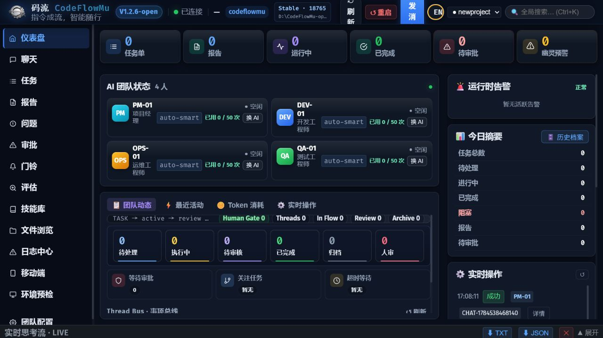
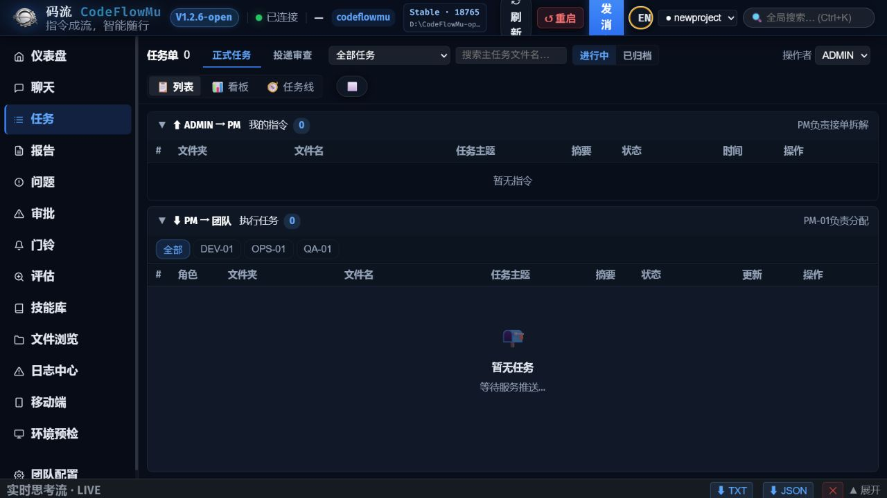
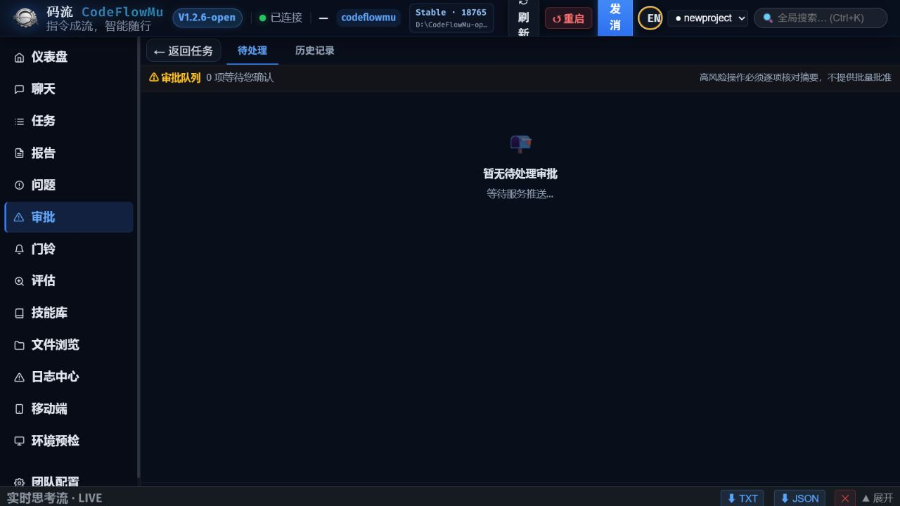
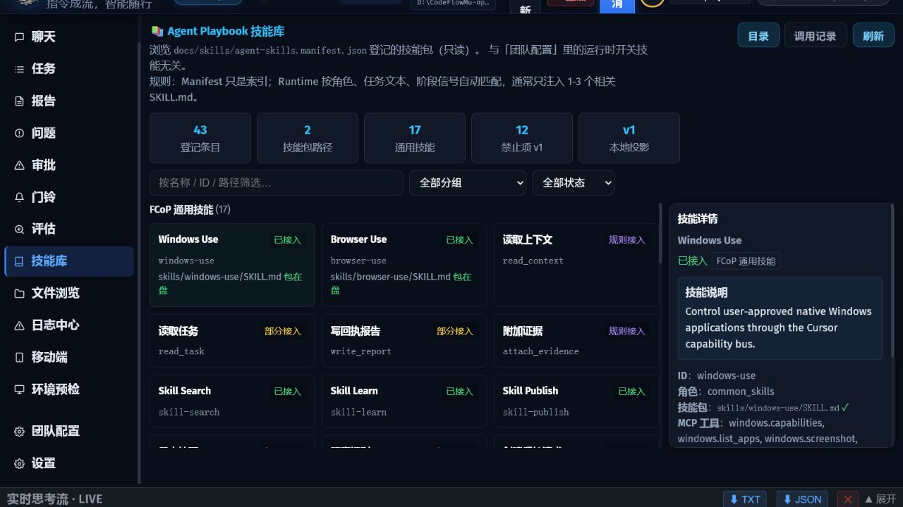
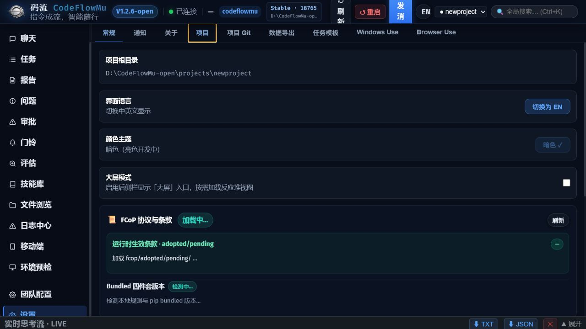
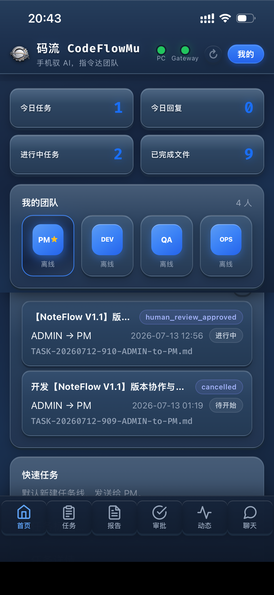
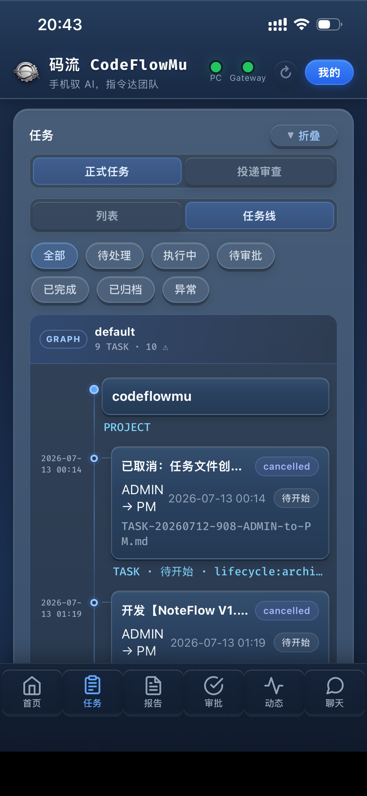
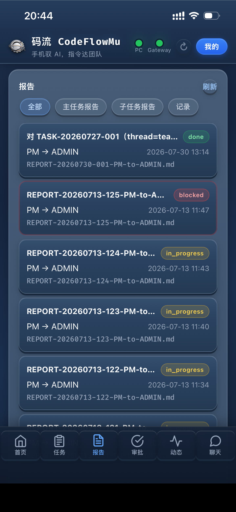
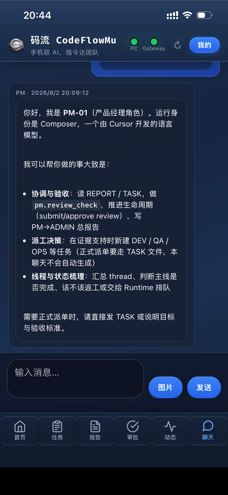
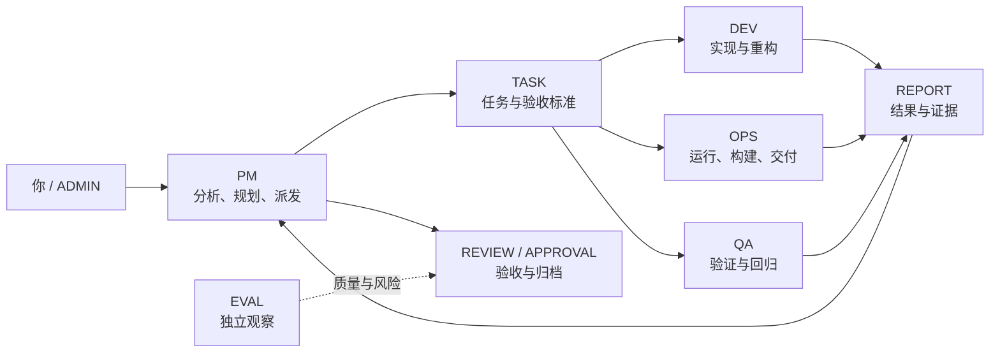

# 码流 CodeFlowMu Open Dev Team Edition

<p align="center">
  
</p>

<p align="center">
  <strong>把 AI Agent 组织成一个可见、可审计、可协作的本地开发团队。</strong>
</p>

<p align="center">
  <code>V1.2.7-open</code> · <code>Windows 10/11</code> · <code>Node.js 22+</code> · <code>Python 3.10+</code> · <code>Cursor SDK</code>
</p>

<p align="center">
  <a href="README.md">English README</a> ·
  <a href="#快速安装">快速安装</a> ·
  <a href="#真实界面">真实界面</a> ·
  <a href="INSTALL.md">安装手册</a> ·
  <a href="docs/open/help.zh.md">PC 与 PWA 操作手册</a>
</p>

---

CodeFlowMu Open 是一个本地优先的多 Agent 开发团队应用。你提交需求，PM 负责分析和派发，DEV 实现，OPS 处理运行与交付，QA 验证；任务、报告、证据、审批和项目状态统一呈现在 PC Panel，并可通过手机 PWA 随时查看和操作。

它解决的不是“再增加一个聊天窗口”，而是让多个 Agent 围绕同一套可追踪的任务生命周期协作：

```text
需求 → PM 规划 → TASK → DEV / OPS / QA → REPORT → REVIEW / APPROVAL → 完成
```

## 为什么需要它

普通 Agent 工具通常只解决“让一个 AI 回答问题”。CodeFlowMu 关注的是团队协作：谁接收需求、谁实施、谁验证、交付证据在哪里、哪些动作需要人类批准，以及一个任务为什么完成或阻塞。

| 角色 | 职责 |
|---|---|
| PM | 分析需求、形成计划、派发任务、汇总验收 |
| DEV | 定位代码、实现功能、重构和提交技术证据 |
| OPS | 运行环境、构建、打包、部署与交付检查 |
| QA | 复现问题、验证修复、执行回归测试 |
| EVAL | 独立观察质量、风险和交付信号，不代替 PM 或 QA |

协作过程落到 TASK、REPORT、REVIEW、ISSUE 和证据文件中，因此可以回看、交接和审计，而不是只存在于一次聊天上下文里。

## 核心能力

| 能力 | 说明 |
|---|---|
| PC 管理端 | 工作台、任务、报告、审批、聊天、技能库、文件、日志、项目和团队配置 |
| Mobile PWA | 手机查看团队状态、任务、报告、审批、动态，也可发布任务和发送消息 |
| FCoP 文件协作 | 用统一生命周期连接 TASK、执行、REPORT、REVIEW 和归档 |
| 项目隔离 | 安装根与业务项目分离，每套安装拥有独立 Runtime 身份和状态目录 |
| 人工审批门禁 | 破坏性操作、外部写入和权限边界变更必须在动作发生前得到授权 |
| Windows/Browser Use | 只操作用户登记并明确允许的本机应用和浏览器目标 |
| Agent Playbook | 按公开 Manifest 装载角色技能，项目内同名技能优先 |
| 本地与 Git | 本机运行，保留 Git 状态、数据导出、任务模板和开源贡献入口 |

## 真实界面

以下均为真实系统截图，不是概念效果图。当前应用版本为 `V1.2.7-open`；中文 PC 截图采集自正在运行的 `V1.2.6-open`；手机截图采集自真实 PWA V1.0.58，“本版更新”截图采集于 V1.0.59。

### PC Panel：一屏掌握整个开发团队

<p align="center">
  
</p>

仪表盘集中展示当前项目、团队角色状态、任务和报告数量、运行告警、审批队列与实时活动。顶部项目和实例信息帮助确认 Agent 正在正确的业务目录中工作。

### 从任务派发到受控审批

<p align="center">
  
</p>
<p align="center"><sub>任务中心：正式任务、投递审查、列表、看板与任务线</sub></p>

<p align="center">
  
</p>
<p align="center"><sub>操作审批：高风险动作在执行前由人类明确授权</sub></p>

任务页面支持正式任务、投递审查、列表、看板和任务线；审批页面只处理真正需要人类授权的高风险动作。审批通过不代表业务已经完成，最终结果仍由 REPORT、测试和验证证据确认。

### 技能与项目都可见

<p align="center">
  
</p>
<p align="center"><sub>Agent Playbook 技能库：查看技能包、角色映射与装载状态</sub></p>

<p align="center">
  
</p>
<p align="center"><sub>项目与版本：管理业务项目、当前工作根和版本更新记录</sub></p>

技能库展示 Playbook 的装载、角色映射和调用状态；项目管理负责新建、登记和切换业务项目，并让 Runtime、MCP、Watcher 与 Agent 工作目录同步切换。

### Mobile PWA：离开电脑也能掌握团队

<p align="center">
  <a href="docs/images/pwa/V1.0.58/pwa-dashboard-V1.0.58.png"></a>
  &nbsp;
  <a href="docs/images/pwa/V1.0.58/pwa-tasks-timeline-V1.0.58.png"></a>
  &nbsp;
  <a href="docs/images/pwa/V1.0.58/pwa-reports-V1.0.58.png"></a>
  &nbsp;
  <a href="docs/images/pwa/V1.0.58/pwa-chat-V1.0.58.png"></a>
</p>
<p align="center"><sub>首页概览 · 任务线 · 报告 · 团队聊天（点击缩略图查看原图）</sub></p>

PWA 提供首页、任务、报告、审批、动态、聊天和设备状态；任务线适合追踪父子任务，报告页用于核对交付，聊天页可直接联系对应角色。

> 完整查看 PC 与 PWA 图文操作说明：[PC 与 PWA 操作手册](docs/open/help.zh.md)。

## 团队工作流


```mermaid
flowchart LR
  Human["你 / ADMIN"] --> PM["PM<br/>分析、规划、派发"]
  PM --> TASK["TASK<br/>任务与验收标准"]
  TASK --> DEV["DEV<br/>实现与重构"]
  TASK --> OPS["OPS<br/>运行、构建、交付"]
  TASK --> QA["QA<br/>验证与回归"]
  DEV --> REPORT["REPORT<br/>结果与证据"]
  OPS --> REPORT
  QA --> REPORT
  REPORT --> PM
  PM --> REVIEW["REVIEW / APPROVAL<br/>验收与归档"]
  EVAL["EVAL<br/>独立观察"] -.->|质量与风险| REVIEW
```

复杂产品任务会先经过 PM Level 0–3 规划分级，再创建下游任务。完整规则见 [PM 分析、规划与产品设计规范](docs/skills/pm-planning-governance.md)。

## 快速安装

### 环境要求

- Windows 10/11（推荐，包含一键启动器）
- Node.js 22+
- Python 3.10+
- Git
- 可使用的 Cursor SDK / API Key

### Windows 推荐方式

在 CMD 中执行：

```bat
cd /d D:\
git clone https://github.com/joinwell52-AI/CodeFlowMu-open.git
cd CodeFlowMu-open
START-CODEFLOWMU-OPEN.bat
```

启动器会检查 Node.js 和 npm、创建 `.venv`、安装 Python `fcop` 与 Node 依赖，并启动本地面板：

```text
http://127.0.0.1:18765/
```

正式启动文件是 `START-CODEFLOWMU-OPEN.bat`。完整说明见 [安装手册](INSTALL.md)。

### 手动方式

```bash
git clone https://github.com/joinwell52-AI/CodeFlowMu-open.git
cd CodeFlowMu-open
npm install
npm start
```

## 首次使用

1. 打开“设置 → 常规”，填写并验证 Cursor API Key。
2. 打开“设置 → 项目”，使用默认 `projects/newproject`、创建独立项目或添加已有源码。
3. 将准备工作的目录设为当前项目，等待 Runtime 适配完成。
4. 执行环境预检；仅在系统提示时初始化或修复 FCoP。
5. 创建第一份 TASK，从任务、报告和实时活动中观察团队执行过程。

> `CodeFlowMu-open` 是受保护的工具安装根，不是交给 Agent 修改的业务项目。业务代码、TASK、REPORT、附件和 FCoP 账本写入当前项目根。

## 怎么操作：完成第一个任务闭环

| 步骤 | PC Panel 位置 | 操作 | 完成标志 |
|---|---|---|---|
| 1. 确认服务 | 顶部状态栏 / 仪表盘 | 打开 `127.0.0.1:18765` | 顶部显示绿色“已连接” |
| 2. 配置模型 | 设置 → 常规 | 填写 Cursor API Key，保存并验证 | 出现绿色验证状态并加载模型 |
| 3. 选择项目 | 设置 → 项目 | 使用默认项目、新建项目或登记已有源码，然后“设为当前” | 顶部项目名和项目根一致 |
| 4. 检查环境 | 环境预检 | 按提示初始化或修复 FCoP | 没有阻断项，Runtime 已适配当前项目 |
| 5. 发布任务 | 任务 → 投递审查 | 填写任务或上传 Markdown 任务书，检查后发布 | 正式 TASK 出现在任务列表 |
| 6. 跟踪执行 | 仪表盘 / 任务 / 实时活动 | 查看 PM 派发以及 DEV、OPS、QA 的执行状态 | 子任务开始流转并生成 REPORT |
| 7. 验收结果 | 报告 / 审批 | 阅读报告与证据；只有系统提示高风险动作时才审批 | PM 汇总验收，任务进入完成或返工 |
| 8. 使用手机 | 移动端 / PWA“我的” | 从 PC 获取绑定入口，在手机完成绑定 | PWA 顶部 PC 与 Gateway 状态正常 |

> **完整图文操作手册：**[打开《CodeFlowMu Open PC 与 PWA 操作手册》](docs/open/help.zh.md)。手册包含 22 张 PC 截图、9 张 PWA 截图以及任务、项目、审批、技能、Git、数据工具和手机端的逐步说明。

## 安装目录与业务项目

```text
D:\CodeFlowMu-open\                 # 工具安装根，受保护
├─ projects\newproject\             # 默认业务项目
├─ projects\<your-project>\         # 由面板创建的独立项目
└─ ...                               # Panel / Shell / Runtime / docs

D:\YourExistingProject\             # 也可以登记外部已有项目
└─ fcop\                             # 该项目自己的任务与协作账本
```

每套安装创建自己的 `.codeflowmu/instance.json`；Agent 和 Session Runtime 状态位于 `%USERPROFILE%\.codeflowmu\instances\<instance_id>\`。同名项目和复制安装不会共用 Runtime 身份。

## 更新

先停止当前服务，然后执行：

```bat
cd /d D:\CodeFlowMu-open
git pull --ff-only
npm install
START-CODEFLOWMU-OPEN.bat
```

更新会替换应用源码、Panel、Shell/Runtime、文档和公开模板，同时保留 `.git/`、`.venv/`、`node_modules/`、本机 `.env`、`projects/`、旧版 `workspace/` 及外部项目。

## Open 版边界

### 包含

- PC Panel 与本地 Mobile PWA
- PM / DEV / OPS / QA 固定开发团队
- EVAL 独立质量与风险观察
- FCoP 协作协议和公开 Agent Playbook
- Cursor SDK 接入
- Windows Use 与 Browser Use 的显式授权能力
- Git 状态、任务模板、数据导出和项目管理

### 不包含

- 私有 Gateway 凭据与公司内部发布基础设施
- 母版真实任务、报告、日志、聊天和客户数据
- `.env`、Token、API Key 或其他秘密
- Google Gen AI、Claude Code、OpenRouter 等私有多 Provider 切换
- 母版内部治理实验和私有运行历史

Open 与母版使用不同端口、实例身份和运行状态。Open 默认地址是 `127.0.0.1:18765`。

## 文档导航

- [安装说明](INSTALL.md)
- [首次使用](docs/open/getting-started.md)
- [PC 与 PWA 操作手册（真实截图）](docs/open/help.zh.md)
- [版本边界](docs/open/edition-boundary.md)
- [Gateway 策略](docs/open/gateway-demo.md)
- [目录说明](docs/articles/open-edition-directory-manual.md)
- [贡献指南](docs/open/contributing.md)

## 参与贡献

欢迎改进安装体验、跨平台支持、Panel/PWA 可用性、任务工作流、文档、测试和本地 Runtime 稳定性。提交前请确认不包含真实任务、报告、日志、客户数据、密钥或私有 Gateway 配置。

---

<p align="center">
  <strong>指令成流，智能随行。</strong>
</p>
