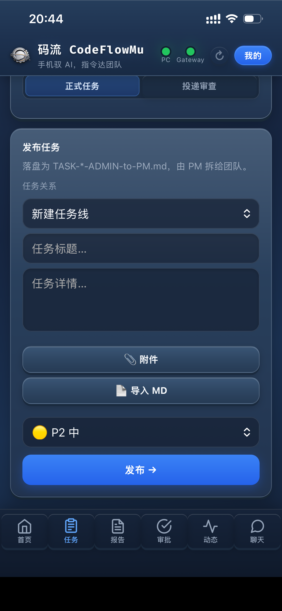
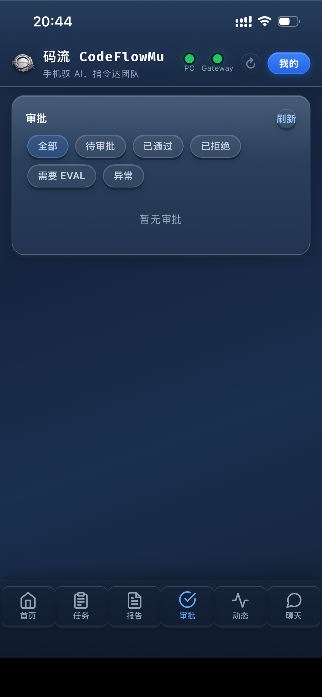
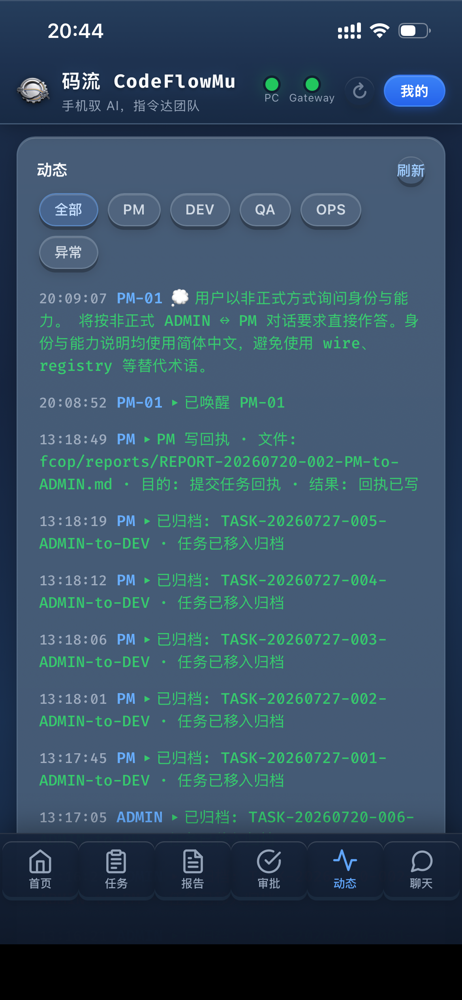
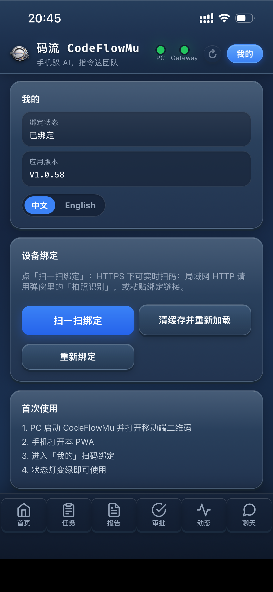
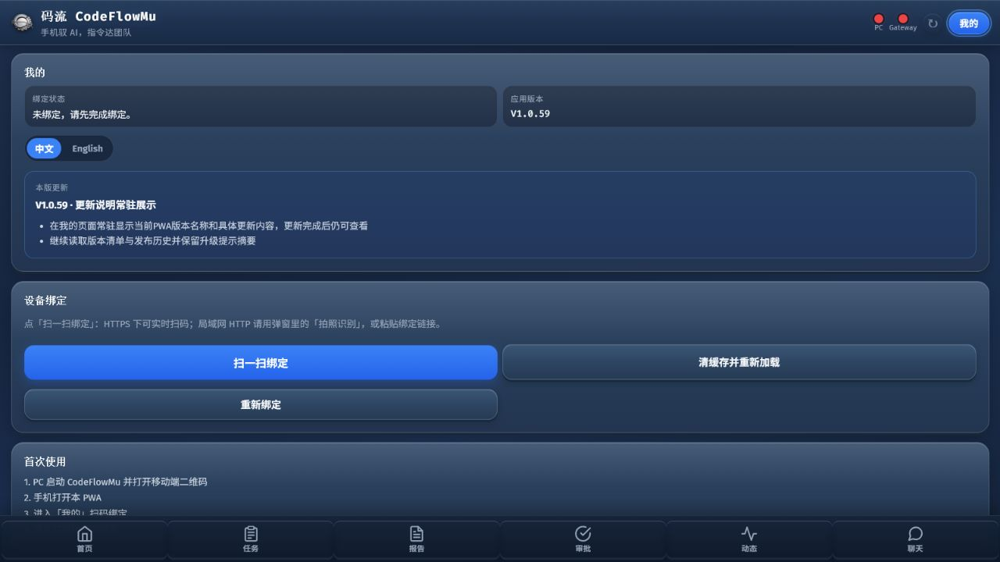

# CodeFlowMu Open PC & PWA Operations Manual

[Chinese Manual](help.zh.md) · [Back to English README](../../README.md)

> Application: V1.2.7-open
>
> PC screenshots: real CodeFlowMu Open V1.2.6 runtime
>
> PWA screenshots: real CodeFlowMu PWA V1.0.58 and V1.0.59

This manual covers the first installation, the first complete task cycle, daily PC operation, and mobile PWA access. CodeFlowMu Open runs locally and organizes PM, DEV, OPS, and QA as a coordinated development team. EVAL observes quality and risk independently.

## 0. Complete the first task in five minutes

| Step | Where | Action | Success signal |
|---|---|---|---|
| 1 | Launcher | Run `START-CODEFLOWMU-OPEN.bat` | `http://127.0.0.1:18765/` opens |
| 2 | Settings > General | Enter, save, and verify the Cursor API Key | Verification is green and models load |
| 3 | Settings > Projects | Use the default project, create a project, or register an existing source directory; make it current | Header project and project root match |
| 4 | Environment Preflight | Initialize or repair FCoP only when prompted | No blocking item remains |
| 5 | Tasks > Submission Review | Enter a task or upload a Markdown task specification, review it, and publish | A formal TASK appears |
| 6 | Dashboard / Tasks | Watch PM dispatch DEV, OPS, and QA work | Child tasks start moving and activity appears |
| 7 | Reports | Read delivery results, test output, and evidence | REPORT files appear for the responsible roles |
| 8 | Approvals | Approve only an explicitly requested high-risk action | The authorization record shows the decision |
| 9 | Mobile, optional | Open the binding entry and bind the phone | PWA shows a healthy PC connection |

The shortest business loop is:

```text
Publish TASK -> PM plans and dispatches -> DEV / OPS / QA execute
-> read REPORT evidence -> PM accepts or requests rework
```

## 1. Start the application and confirm the runtime

From the repository root, run:

```bat
START-CODEFLOWMU-OPEN.bat
```

The launcher checks Node.js and npm, creates `.venv` when needed, installs public dependencies, and starts the local Panel. The supported Open address is:

```text
http://127.0.0.1:18765/
```


Before publishing work, confirm all four items:

- the header shows Connected;
- the version is `V1.2.7-open`;
- the selected project is the intended business project;
- no blocking runtime alert is active.

The dashboard summarizes tasks, reports, running work, completed work, pending approvals, agent state, runtime alerts, and live activity. It is the best first stop when checking whether the team is really working.

## 2. Configure the model channel

Open Settings > General.

1. Select the supported provider.
2. Enter the Cursor API Key.
3. Save settings.
4. Run verification.
5. Confirm that the model list is available.

A saved key is local configuration and must never be copied into TASK files, REPORT files, screenshots, or Git commits. A new model selection affects later sessions; an already running session keeps the model captured when it started.

## 3. Create or register a business project

Open Settings > Projects.


You can:

- use the initialized `projects/newproject` project;
- create an independent project below `projects/`;
- register an existing source directory elsewhere on the computer;
- switch the current project from the project list or the header selector.

After switching, verify that the header and the Projects page show the same root. Runtime, MCP, watchers, and agent working directories should move together.

> The `CodeFlowMu-open` repository root is the protected tool installation. Business source, TASK files, REPORT files, evidence, and the FCoP ledger belong in the active project, not in the tool root.

## 4. Publish and track a task

Open Tasks.


Use Submission Review for a new requirement. You may enter the task in the Panel or upload a Markdown task specification. Review the subject, scope, acceptance criteria, priority, and target project before publishing.

If the first review reports a problem:

1. choose Continue Editing;
2. correct the local Markdown file;
3. upload the corrected file and replace the draft;
4. run review again.

Do not repeatedly submit an unchanged rejected draft, and do not create duplicate TASK files to bypass review.

Use the three views for different questions:

- List: inspect individual files and states;
- Board: compare lifecycle stages;
- Timeline: follow parent-child task relationships.

A normal task progresses through TASK, active execution, REPORT evidence, review, completion, and archive. A blocked task must state the concrete blocker and the required next action.

## 5. Read reports and handle approvals

Reports are the delivery record. Check the result, changed files, commands or tests performed, evidence, limitations, and follow-up work. A green agent status alone is not proof of completion.

Open Approvals only when CodeFlowMu asks for human authorization.


Typical approval-bound actions include destructive operations, external writes, releases, credentials, and governance-boundary changes. Review each request individually. Approval means the runtime may attempt the action; it does not mean the action succeeded. Return to Reports and the verification record for the final result.

## 6. Inspect Agent Playbooks

Open Skills.


The library shows the public skill manifest, package path, role mapping, and integration state. The manifest is an index: Runtime matches the role, task text, and lifecycle signal, then injects only the relevant Playbooks.

If a card reports Package missing, confirm that its public `SKILL.md` package is included in the Open release source. Do not solve a missing public package by pointing the Open edition at private mother-edition files.

## 7. Use Git, files, logs, and environment preflight

Use these pages as supporting evidence:

- Files: read the active project structure and FCoP artifacts;
- Log Center: diagnose service and agent events;
- Environment Preflight: initialize or repair the active project only when prompted;
- Project Git: review product changes separately from local runtime and project state;
- Data Export: produce a portable data package;
- Templates: maintain repeatable task-specification structures;
- Windows Use / Browser Use: register explicit local targets before enabling operation.

Never add real tasks, reports, chats, customer data, local environment files, tokens, or runtime history merely to make Git appear clean.

## 8. Bind and use the mobile PWA

Open Mobile in the PC Panel. Use the LAN binding entry when the phone and PC are on the same network, or the approved Gateway entry when Gateway access is available. Do not publish screenshots containing a QR code, binding link, or token.

On the phone:

1. open the PWA;
2. open Me;
3. choose Scan to bind or paste the binding link;
4. wait for the PC state to become healthy;
5. use Me > English to switch the PWA language when needed.

The real phone captures below use the Chinese UI; the English UI has the same navigation and is available from Me > English. Thumbnails are intentionally small. Click one to open the original image.

<p align="center">
  <a href="../images/pwa/V1.0.58/pwa-dashboard-V1.0.58.png"></a>
  &nbsp;
  <a href="../images/pwa/V1.0.58/pwa-tasks-timeline-V1.0.58.png"></a>
  &nbsp;
  <a href="../images/pwa/V1.0.58/pwa-reports-V1.0.58.png"></a>
</p>

### Publish and follow work

The Home page shows the team, daily counts, task list, and quick task form. Tasks provides list and timeline views. Reports exposes delivery evidence. Approvals handles only explicit authorization requests.

<p align="center">
  <a href="../images/pwa/V1.0.58/pwa-publish-task-V1.0.58.png"></a>
  &nbsp;
  <a href="../images/pwa/V1.0.58/pwa-approvals-V1.0.58.png"></a>
  &nbsp;
  <a href="../images/pwa/V1.0.58/pwa-activity-V1.0.58.png"></a>
</p>

### Chat and device settings

Chat sends a message to the responsible role. Me shows bind status, PWA version, language, release notes, cache reload, and re-binding actions.

<p align="center">
  <a href="../images/pwa/V1.0.58/pwa-chat-V1.0.58.png"></a>
  &nbsp;
  <a href="../images/pwa/V1.0.58/pwa-my-settings-V1.0.58.png"></a>
  &nbsp;
  <a href="../images/pwa/V1.0.59/pwa-release-notes-V1.0.59.png"></a>
</p>

## 9. Common problems

| Symptom | Action |
|---|---|
| Panel project is correct but a TASK cannot be found | Confirm Runtime, MCP, and watchers are bound to the same active project. Stop project writes if startup diagnostics still disagree. |
| `Runtime writer lock is already owned` | Another instance owns the same writer lock. Return to the existing Panel or stop that instance through the controlled shutdown flow. |
| Submission Review still shows old content | Continue editing, upload the corrected Markdown file, replace the draft, and review again. |
| A public build reports a missing import or type | Release the caller, implementation, type definition, and required tests as one complete change group. |
| Images are missing on GitHub | Keep screenshots under `docs/images/`, include them in the Open release source, and use repository-relative links. |
| PWA cannot connect over LAN | Put phone and PC on the same network, confirm port 18765 is reachable, and allow the Open port through Windows Firewall when required. |
| Gateway is offline | Local PC operation can continue. Retry Gateway only after its public configuration and network path are available. |

## 10. Safe operating boundary

- Keep the installation root separate from business projects.
- Store secrets only in local environment configuration.
- Approve high-risk actions only after reading the exact target and scope.
- Treat REPORT evidence and verification as the completion signal.
- Keep public screenshots free of QR codes, binding links, tokens, customer data, and private runtime information.
- Stop the existing service before updating or starting another instance with the same identity.

Related documents:

- [Installation Guide](../../INSTALL.md)
- [Getting Started](getting-started.md)
- [Edition Boundary](edition-boundary.md)
- [Gateway Policy](gateway-demo.md)
- [Contributing](contributing.md)
